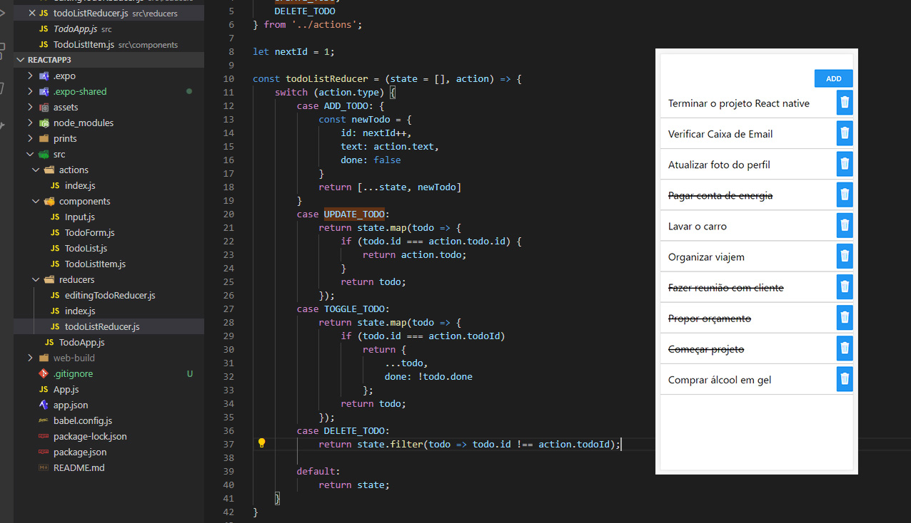

# TODOList com REDUX

Welcome APP!

Tarefa 3 - TodoApp - React-Redux
Implementar funcionalidade de **apagar tarefa** e **corrigir bug** que deixa salvar tarefa com **'title' vazio**. 

Implementado com:
When you're ready to see everything that Expo provides (or if you want to use your own editor) you can **Export** your project and use it with [expo-cli](https://docs.expo.io/versions/latest/introduction/installation.html).

# Tela

	 
	
       

